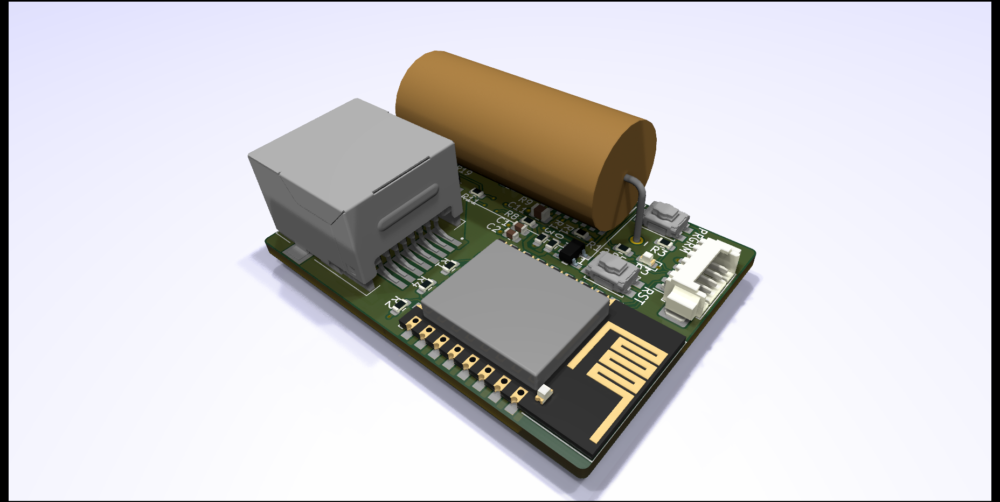

# HAN-to-WLAN interface module
This is a hardware project where the readings of electrical power-meters will be interfaced for logging and display without further interaction with external servers and third-party vendors.

## Hardware
The hardware-module are developed with the Aidon-meters in mind, which is the most used power-meter in eastern Norway.
The hardware-module is a standalone module powered by the HAN-port of the AMS-meter without the neccesity of external power supply. For Aidon, there is a maximum current delivery of 30 mA, which is the highest ammount among the AMS-vendors used in Norway.

## Data parsing
This repository contains only the hardware. You can either write your own firmware for the ESP8266, but I recommend using [AmsToMqttBridge](https://github.com/gskjold/AmsToMqttBridge) from GSkjold.

